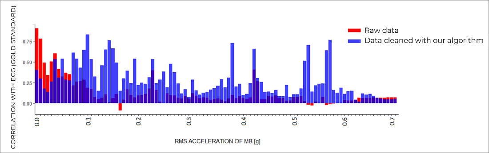
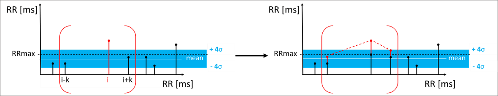

<!-- Text stuff -->
<!-- <h1>IN PROGRESS</h1> -->

<h3>Evidence-based treatment for alexithymia using wearables</h3>

Alexithymia is the inability to identify, recognize, describe emotions and distinguish between feelings and physical manifestations of emotional arousal. Approximately, <b>13.5% of general population</b> and nearly <b>30% of older adults suffer from alexithymia</b>. Currently, there exist no evidence-based treatment for this condition.

<a href="https://www.ccis.northeastern.edu/people/stefan-olaffson/">Stefán Ólafsson</a> and I decided to design a working prototype which helps stimulate brain's anterior insular cortex by asking patients simple questions throughout the day. Insufficient development of this brain area is hypothesized to cause alexithymia.

Our algorithm improves data quality (concordance correlation coefficient) by 14.4% outperforming Microsoft's solution. One unique feature of the algorithm is its ability to remove motion artifacts without accessing any motion data.

 
<!-- 
 -->

<h4>Technologies used</h4>
<ul>
<li>R</li>
<li>Tableau</li>
 

<h4>Information about the algorithm was presented at the following conferences:</h4>
- The 39th Annual International Conference of the IEEE Engineering in Medicine and Biology Society (EMBC’17)  
- American Medical Informatics Association Annual Symposium 2017
 
See <a href="https://maciejkos.github.io//assets/documents/AMIA2017-poster-final-mkos.pdf" class="logo">my AMIA poster here.</a>
